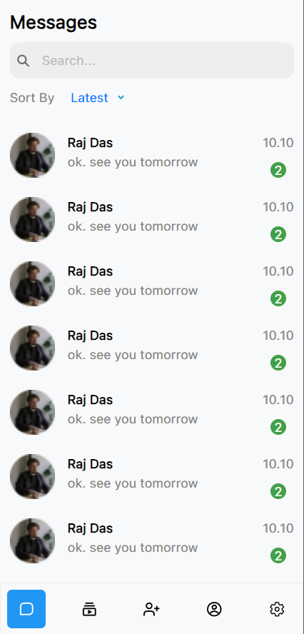

# Chat Application Template

A responsive and feature-rich chat application template built with React, Material Tailwind, and Tailwind CSS. This template provides essential functionalities for a chat application, such as messaging, friend search, friend requests, real-time notifications, and customization options.

## Features

- **Real-time Messaging**: Send and receive messages in real-time.
- **Friend Search & Requests**: Search for friends and send friend requests.
- **Block Users**: Block unwanted users.
- **Real-time Notifications**: Receive real-time notifications for messages and friend requests.
- **Friend Feeds**: View the feed and statuses of friends.
- **User Customization**: Customize profile picture, about section, and chat background.
- **Privacy Controls**: Manage visibility of last seen, online status, and profile picture.
- **PIN System**: Enable and set a security PIN.

## Preview





## Installation

1. **Clone the repository**:

   ```bash
   git clone https://github.com/nuralam9922/Chat-Application-Template-react-
   cd chat-application-template
   ```

2. **Install dependencies**:

   ```bash
   npm install
   ```

3. **Start the development server**:
   ```bash
   npm start
   ```
## Live website Link 
https://chat-application-template-react.vercel.app/


## Usage

1. **Home Page**: The entry point of the application where users can see an overview of features.
2. **Chat Page**: The main interface for sending and receiving messages.
3. **User Settings**: Allows users to customize their profile and privacy settings.

## Components

### Welcome Section

The `WelcomeSection` component introduces users to the application and highlights its features with visual aids.
